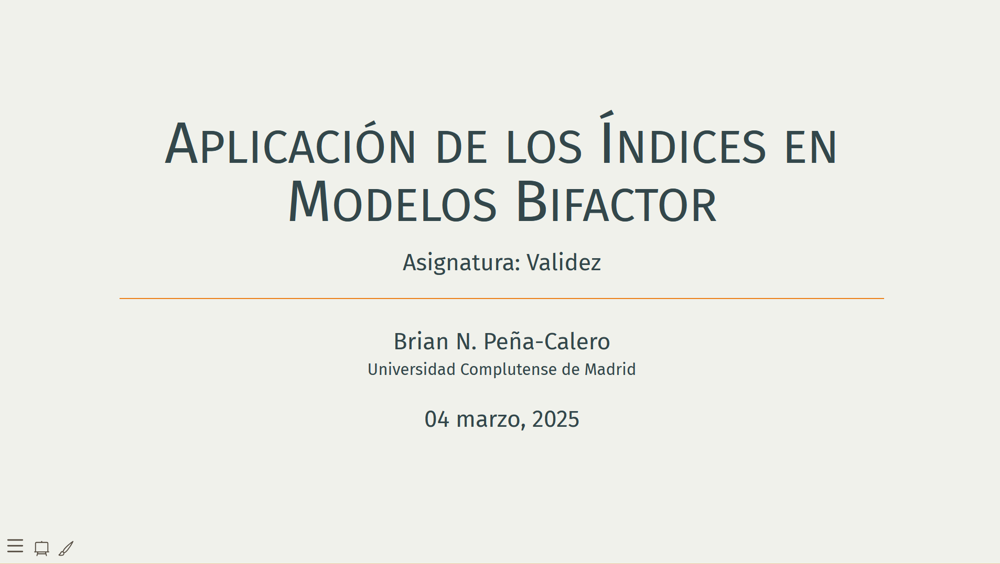

# Presentación sobre Índices en Modelos Bifactor

Este repositorio contiene la presentación **"Aplicación de los Índices en Modelos Bifactor"**, en la cual se abordan los principales indicadores utilizados para evaluar modelos bifactor y su aplicabilidad en análisis psicométricos y modelos de ecuaciones estructurales (SEM).

📢 **Accede a la presentación aquí:**\
👉 [**Ver presentación**](https://brianmsm.github.io/bifactor-indices-presentacion/)

[](https://brianmsm.github.io/bifactor-indices-presentacion/)

------------------------------------------------------------------------

## 📌 Contenido de la Presentación

Esta presentación explora tres preguntas clave en la evaluación de modelos bifactor, basadas en Rodríguez et al. (2016):

1.  **¿Los puntajes totales reflejan variación en una sola variable latente?**
    -   Se presentan los coeficientes $\omega$ y $\omega_H$ para evaluar la varianza explicada por el factor general y los factores específicos.
    -   Se analiza la fiabilidad de las subescalas mediante $\omega_S$ y $\omega_{HS}$.
2.  **¿Pueden los ítems usarse para especificar variables latentes en SEM?**
    -   Se explican los índices de **Factor Determinacy (FD)** e **Índice H**, que evalúan la calidad de las estimaciones factoriales y la replicabilidad del constructo.
3.  **¿Son las medidas esencialmente unidimensionales?**
    -   Se utilizan los índices **Explained Common Variance (ECV)** y **Percentage of Uncontaminated Correlations (PUC)** para determinar si el modelo bifactor puede tratarse como esencialmente unidimensional.

Además, la presentación incluye simulaciones en R de modelos bifactor **"perfectos"** y **"problemáticos"**, comparando la estructura bifactor ideal con configuraciones donde los factores específicos dominan sobre el factor general.

------------------------------------------------------------------------

## 🔧 Herramientas Utilizadas

-   [**Quarto**](https://quarto.org/) con **Reveal.js** para la generación de diapositivas interactivas.
-   **R y lavaan** para la simulación y ajuste de modelos bifactor.
-   **Paquetes adicionales:** `semPlot`, `BifactorIndicesCalculator`, `ggplot2`, `psymetrics`.

------------------------------------------------------------------------

## 🚀 Cómo Ejecutar el Código

Para replicar los análisis y simulaciones, descarga el repositorio y abre una sesión en R con los siguientes paquetes instalados:

``` r
install.packages(c("lavaan", "semPlot", "BifactorIndicesCalculator", "ggplot2"))
remotes::install_github("brianmsm/psymetrics")
source("https://github.com/brianmsm/bifactor-indices-presentacion/raw/refs/heads/main/simulaBifactor.R")
```

------------------------------------------------------------------------

📢 No olvides visitar la presentación interactiva aquí: 👉 <https://brianmsm.github.io/bifactor-indices-presentacion/>
